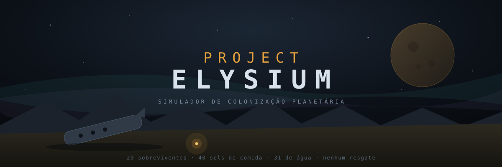

<h1 align="center">PROJECT ELYSIUM</h1>

<p align="center">
  <b><a href="https://wc4mp0s.github.io/elysium/">▶ JOGAR NO NAVEGADOR</a></b><br>
  <sub>Português · English · grátis · sem instalar nada</sub><br>
  <sub>um jogo de <a href="mailto:wemersoncampos@yahoo.com.br"><b>Wemerson Campos</b></a></sub>
</p>

<p align="center">
  
  
  
  
</p>

---

Simulador de colonização planetária jogável no navegador. Vinte sobreviventes, um planeta
nunca habitado, nenhum resgate possível. Tudo — água, comida, metal, energia, eletricidade,
indústria, ciência — precisa ser construído do zero.

**HTML + CSS + JavaScript puro. Sem framework, sem backend, sem banco de dados, sem dependências.**

Cada turno é um *sol* de 27,4 horas. Você aloca vinte pessoas com perícias, traços de
personalidade, fadiga, fome e relações entre si; decide o que pesquisar, o que construir e
quanto racionar. A água acaba antes da comida. A comida acaba antes da primeira colheita.
Essa conta não fecha sozinha — e é aí que o jogo começa.

| | |
|---|---|
| **120 setores** de 25 × 25 km, com névoa de guerra | **105 recursos** naturais catalogados |
| **74 tecnologias** em 6 tiers, do forno de barro à fusão | **59 edificações** com consumo e desgaste |
| **89 eventos**, muitos exigindo uma decisão sua | **16 cultivares** e um modelo real de solo |
| Clima, estações, marés de duas luas, fulgurações | Determinístico: mesma semente = mesma partida |

> A NAV Perseverança caiu no planeta EL-7742, a 22,7 anos-luz da Terra. O transmissor
> interestelar foi destruído. **Não haverá resgate. Nunca.** Você não está tentando sobreviver
> até ser encontrado — está fundando uma civilização.

### O que mais tem dentro

| | |
|---|---|
| **Doutrinas** — 3 encruzilhadas que fecham caminhos para sempre | **Expedições** — equipes fora da base por vários sols |
| **Demandas** — pedidos da tripulação, com prazo correndo | **Desafio diário** — mesma semente para todo mundo, todo dia |
| **9 cenários** com condições de vitória próprias | **51 conquistas** e um **arquivo de 31 registros** |
| **Crônica do sol** — a história emergente em primeiro plano | **Som sintetizado** por Web Audio, sem nenhum arquivo |
| **Conselhos de meio de jogo** que aparecem quando a situação pede | **Cartão de resultado** em PNG, pronto para compartilhar |

**Novo por aqui?** Comece no modo **Sobrevivente** e siga a orientação guiada. O manual
completo está em [COMO_JOGAR.md](COMO_JOGAR.md).

---

<details>
<summary><b>English</b></summary>

A planetary colonisation simulator that runs in the browser. Twenty survivors, an uninhabited
planet, no rescue — ever. Water, food, metal, power, electricity, industry and science all
have to be built from nothing.

Pure HTML, CSS and JavaScript. No framework, no backend, no database, no dependencies.

Each turn is a *sol* of 27.4 hours. You assign twenty people with skills, personality traits,
fatigue, hunger and relationships; you decide what to research, what to build and how hard to
ration. Water runs out before food. Food runs out before the first harvest. That arithmetic
does not work on its own — which is where the game starts.

120 sectors with fog of war · 105 catalogued resources · 74 technologies across 6 tiers ·
59 structures · 89 events · 16 cultivars with a real soil model · weather, seasons, twin-moon
tides and stellar flares · fully deterministic from a world seed.

Also inside: 3 permanent doctrine crossroads, expeditions, standing crew requests with
deadlines, a daily challenge, 9 scenarios, 51 achievements, a 31-entry archive, the sol
chronicle that puts emergent story front and centre, synthesised audio with no asset files,
and a shareable PNG result card.

Switch language with the **EN/PT** button in the top bar. New players should start on
**Survivor** difficulty and follow the in-game guidance.

</details>

---

## Como rodar

**Opção 1 — abrir direto:** dê dois cliques em `index.html`. Funciona.

**Opção 2 — MAMP:** a pasta já está em `htdocs`. Inicie o MAMP e acesse
`http://localhost/elysium/`.

**Opção 3 — qualquer servidor estático:**

```bash
python3 -m http.server 8899
```

Depois abra `http://localhost:8899`.

## Como publicar

É um site estático: basta subir a pasta inteira.

- **GitHub Pages / Netlify / Vercel / Cloudflare Pages** — arraste a pasta, pronto, grátis.
- **Hospedagem comum (Hostinger, Locaweb…)** — envie por FTP para `public_html`.
- **Distribuir offline** — compacte a pasta em `.zip`. Quem receber abre o `index.html`.

Não há nada para configurar, nenhuma porta, nenhuma variável de ambiente, nenhum banco.

---

## Estrutura

```
elysium/
├─ index.html              estrutura da página
├─ css/style.css           interface
├─ js/
│  ├─ data/                CONTEÚDO — edite aqui para modificar o jogo
│  │  ├─ i18n.js           camada de idioma + textos de interface (PT)
│  │  ├─ i18n_en*.js       dicionário inglês (dados, eventos, interface)
│  │  ├─ world.js          planeta, mapa 12×10, biomas, estações, motor de clima
│  │  ├─ resources.js      ~100 materiais + 105 recursos naturais catalogados
│  │  ├─ crew.js           os 20 sobreviventes, perícias, traços, relações
│  │  ├─ tech.js           74 tecnologias em 6 tiers
│  │  ├─ buildings.js      59 edificações
│  │  ├─ crops.js          16 cultivares + modelo de solo e pragas
│  │  ├─ jobs.js           14 postos fixos + 50 receitas de produção
│  │  ├─ events.js         89 eventos, muitos com decisão do jogador
│  │  │                    (inclui o arco da Anomalia, em 6 etapas)
│  │  ├─ doutrinas.js      3 encruzilhadas × 3 opções, permanentes
│  │  ├─ demandas.js       14 pedidos da tripulação, com prazo
│  │  ├─ cenarios.js       9 cenários com vitória própria
│  │  ├─ conquistas.js     51 conquistas verificadas no motor
│  │  └─ arquivo.js        31 registros destraváveis
│  ├─ engine/
│  │  ├─ rng.js            aleatoriedade determinística por semente
│  │  ├─ state.js          criação, salvamento, exportação
│  │  ├─ sim.js            resolução do turno (o coração do jogo)
│  │  ├─ expedicao.js      equipes em campo, risco e espólio
│  │  └─ diario.js         desafio diário
│  ├─ ui/
│  │  ├─ ui.js             renderização das 10 abas
│  │  ├─ cronica.js        a crônica do sol — história emergente
│  │  ├─ conselhos.js      conselhos contextuais de meio de jogo
│  │  ├─ som.js            áudio sintetizado (Web Audio, zero arquivos)
│  │  ├─ cartao.js         cartão de resultado em PNG
│  │  └─ onboarding.js     tutorial guiado e tela de fim de partida
│  └─ main.js              inicialização
└─ COMO_JOGAR.md           manual do jogador
```

## Salvamento

Automático, em `localStorage` do navegador. **Menu → Exportar** gera um `.json` para backup
ou para continuar em outra máquina. Nenhum dado sai do computador do jogador.

## Determinismo

A mesma semente + as mesmas decisões produzem exatamente a mesma partida. Isso permite
comparar estratégias e reproduzir bugs. A semente é escolhida na tela inicial.

---

## Modificar o jogo

Todo o conteúdo está em `js/data/`. Os arquivos são listas simples — não é preciso mexer
no motor para expandir o jogo.

**Nova tecnologia** (`tech.js`):
```js
{id:'meu_id', n:'Nome', t:3, pp:50, req:['eletricidade'], cat:'Energia',
 d:'Descrição que o jogador lê.', ef:{pesquisaMult:1.2}}
```

**Nova edificação** (`buildings.js`):
```js
{id:'meu_predio', n:'Nome', cat:'Energia', tec:'meu_id', pt:20, mat:{aco:100},
 d:'Descrição.', ef:{gen:12, tipo:'solar'}, up:{energia:1}, max:6}
```

**Novo recurso** (`resources.js`): informe `set` (setores do mapa onde existe), `mat`
(material que produz), `y` (rendimento por unidade de trabalho) e `dif` (1–10). Os postos de
extração aparecem sozinhos no jogo quando o setor for alcançável.

**Novo evento** (`events.js`): `peso` pode ser um número ou uma função do estado. Se você
incluir `escolhas`, o jogo pausa e pede a decisão ao jogador.

## Dificuldades

| Modo | Produção | Pesquisa | Consumo | Eventos | Risco |
|---|---|---|---|---|---|
| Sobrevivente | +75% | +75% | −30% | −40% | −50% |
| Difícil | +30% | +30% | −15% | −20% | −25% |
| Realismo Extremo | normal | normal | normal | normal | normal |
| Brutal | −12% | −10% | +12% | +25% | +35% |

**Sobrevivente é o modo padrão e o certo para divulgar.** O Realismo Extremo é punitivo por
projeto: um erro de alocação nos primeiros 30 sols costuma ser fatal 40 sols depois.

## Idiomas

Português e inglês, com troca pelo botão **EN/PT** na barra superior. A escolha fica salva no
navegador e a colônia é preservada na troca.

O português é o original e vive nos arquivos de dados. O inglês é um dicionário aplicado por
cima no carregamento (`js/data/i18n*.js`) — para acrescentar um terceiro idioma, basta copiar
`i18n_en.js` e traduzir os valores, sem tocar no motor.

## Tutorial e fim de partida

A primeira colônia recebe uma **orientação guiada de 8 passos** que detecta o que o jogador
já fez e avança sozinha. Ela pode ser dispensada a qualquer momento.

Depois dela entram os **conselhos de meio de jogo**: 14 avisos que não formam fila — cada um
espera a situação acontecer, aparece uma única vez e some. São as armadilhas que matam
colônias no sol 300, não no sol 4: a ração cortada que ninguém restaurou, o prédio apodrecendo
sem manutenção, o laboratório caído que zera a pesquisa, o Gélido chegando.

Quando a colônia acaba (ou vence), aparece uma **tela de resultado** com sols sobrevividos,
causa do fim, gráfico de população e moral, marcos alcançados, memorial dos mortos, uma lição
concreta baseada no que falhou, e um texto pronto para copiar e compartilhar.

## Ranking online (opcional, não incluído)

O jogo não precisa de servidor. Se um dia você quiser um placar global, dá para acrescentar
um `api/ranking.php` com uma tabela MySQL e um `fetch()` no fim de partida — sem tocar em
nada do motor.

---

## Autor

**Wemerson Campos** — [wemersoncampos@yahoo.com.br](mailto:wemersoncampos@yahoo.com.br)

## Licença

MIT. Livre para jogar, modificar e distribuir.
